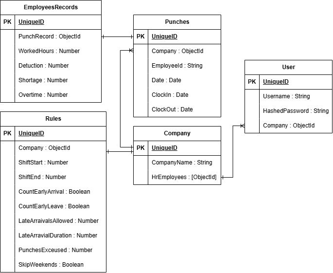

# AttendEase
HR Attendance System

# StudyBuddy Backend API

## Overview
A tool that reads employee fingerprint IN/OUT data, compares it against a standard company shift and attendance rules, and produces a payroll-ready shortage/overtime report, replacing a manual monthly Excel process.

## Related Links

## Technologies Used
- MERN - (MongoDB, Express, React, Node.js)

## ERD 

## Features
- User registration
- User login and authentication
- Authentication middleware
- Setting attendance rules
- Upload biometric punch file (xlsx/csv)
- Auto-calculate shortage/overtime/worked hours per employee, per day, per payroll period accourding to the provided rules